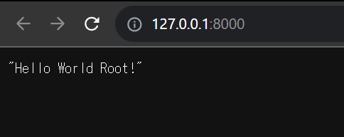

# FastAPI の環境構築手順

手順の参考 → [FastAPI 公式サイト](https://fastapi.tiangolo.com/ja/)

## 1. FastAPI のインストール

FastAPI をインストールするには Python 3.7+ がインストールされていることを確認。
インストールがまだの場合は、[Python のインストール](https://www.python.org/downloads)を参照。

```bash
pip install fastapi
```

## 2. uvicorn のインストール

```bash
pip install "uvicorn[standard]"
```

## 3. FastAPI の起動

```bash
cd backend
uvicorn main:app --reload
```

http://127.0.0.1:8000/ で以下のような表示がされれば成功。

